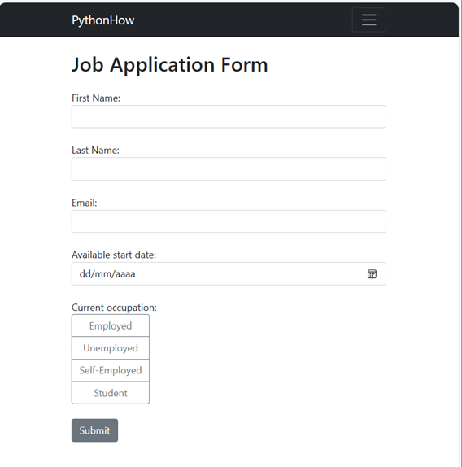
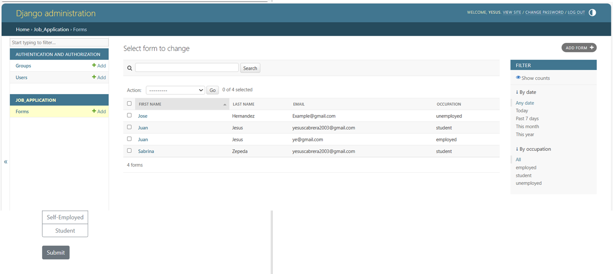

# 📝 Job Application Form - Django Project

This project is a web application developed using the **Django** framework. Its main purpose is to simulate a **job application form**, allowing users to fill in relevant personal and professional details.

## 📋 Features

- Collects applicant's:
  - First and last name
  - Email address
  - Available start date
  - Current occupation (Employed, Unemployed, Self-Employed, Student)
- Displays success messages after submission
- Includes Django's admin panel to view and manage submitted applications
- Styled with Bootstrap classes for a clean and responsive design

## 🎯 Purpose

This application was built as part of a **Python Mega Course: Learn Python in 60 Days, Build 20 Apps**, following the guidance of lessons and tutorial videos. It serves as a hands-on exercise to understand Django forms, templates, views, and the admin interface.

## 🛠️ Technologies Used

- Python
- Django
- HTML5
- Bootstrap (for basic styling)

## 📎 Screenshot 

## 👨‍💻 Author

Juan Jesús Cabrera Gómez 